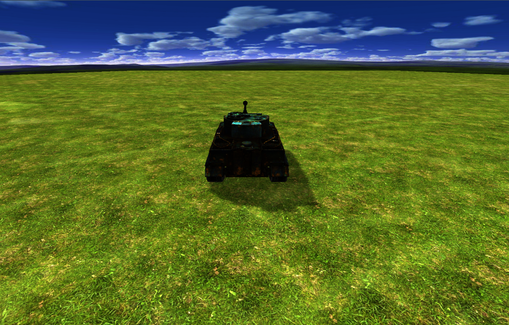
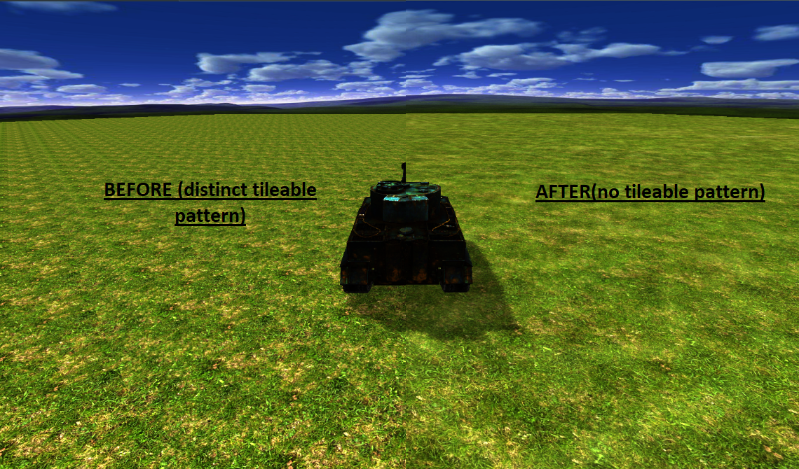
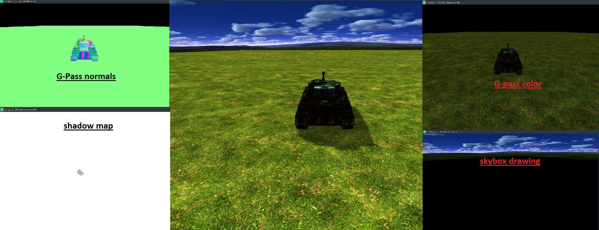
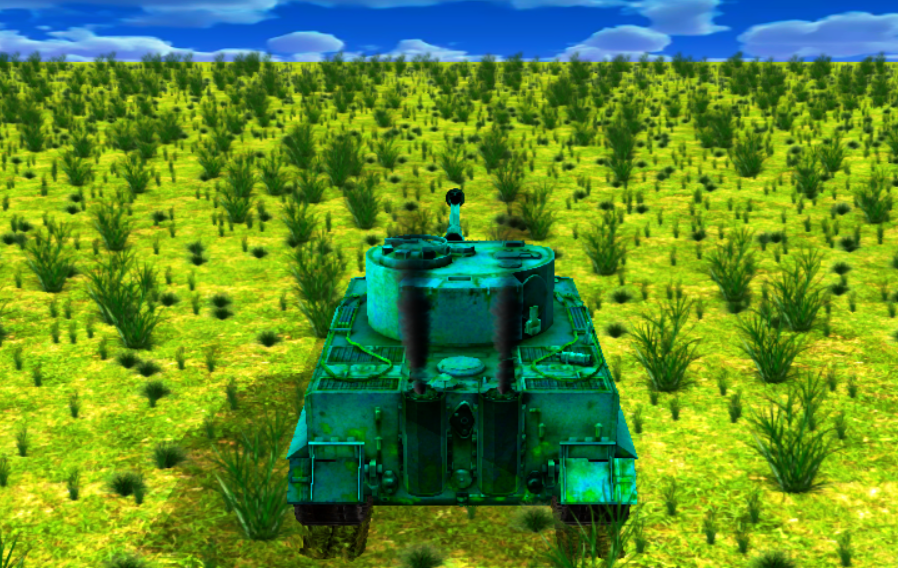
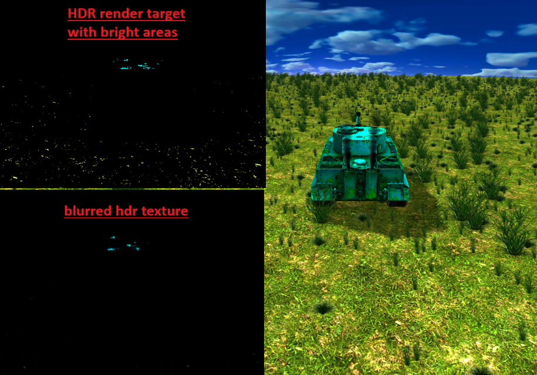
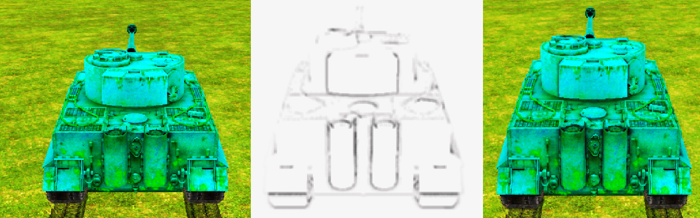
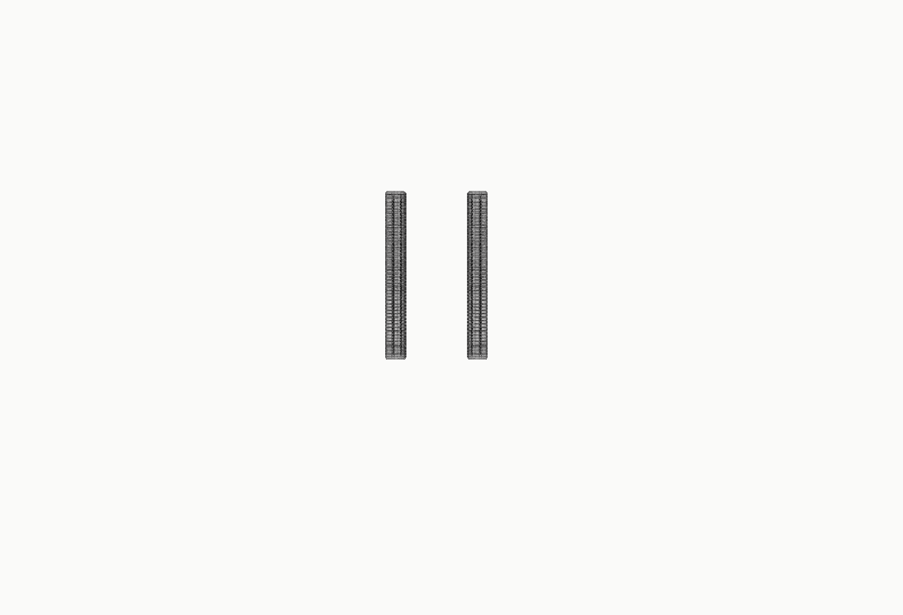
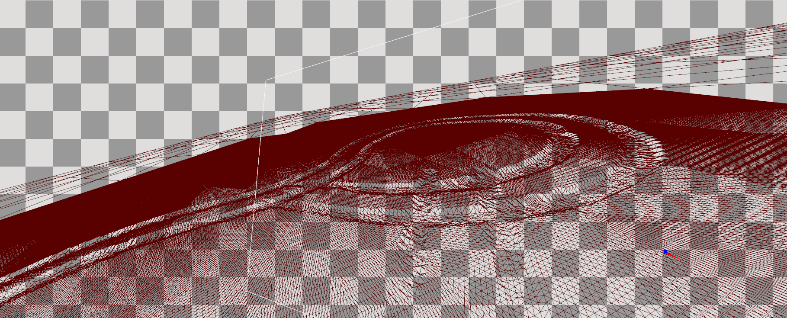

<!DOCTYPE html>
<html>
<body>

<h1>The game engine powered by Vulkan</h1>
  <b>Platforms:</b> Windows/Unix
  <b>Technologies:</b> C++ 17, Vulkan Api, DirectXTK12/SDL2(user input), CMake, WinApi, XCB, stb_image, tinyobjloader

 see my demo: <a href="https://www.youtube.com/watch?v=r8qfUPUFoeg">My Engine Demo</a> 

This is simple game engine based on own engine run by Vulkan API, DirectXTK12/SDL2 (user input)
the developing is ongoing currently, it supports such features as
<ol>
  <li>Vulkan pipeline caching to speedup creation of pipelines for the game</li>
  <li>Liquidating tileable pattern for terrain by using multisampling from textures array(2 grass textures and noise texture) with different textcoords and colors mixing
  

</li>
  <li>Skybox(cubic map)</li>
  <li>Shadows(shadow map) see my result <a href="https://www.youtube.com/watch?v=sBFzkDLPfA0">Shadows</a> </li>
  <li>G-Pass(separate pass with storing depth, normal (using normal mapping) and color to textures and its vulkan subpass for immidiate using produced pixel from main pass to calculate Blinn-Phong lighing, shadow, final color)
  

</li>
  <li>FXAA(final pass for anti aliasing)</li>
  <li>WASD camera manipulation by quaternions</li>
  <li>Instancing applying & Semi-transparent quads drawing on top of G-Pass for bushes(2.5D) which are always perpendicular to camera direction
  <li>Animated Trees (Skeletal animation stored as MD5 files, I have own parser with CPU optimization(interpolated skeleton computation in several worker_threads) 
        and CUDA based computation as alternative option): see my result <a href="https://www.youtube.com/watch?v=SVlCglETmNc"> Animated Trees Video (CPU\CUDA)</a>
  <li>Particles System for smoke spawning by exhaust pipes 
  

</li>
  <li>Bllom effect based on two ping-pong hdr textures wich goes through Gauss X\Y blurring sequentially
  

</li>
  <li>SSAO effect based on depth data, viewspace data and semi-sphera sampling 
  

</li>
  <li>Footprints effect based on separate pass drawing footprint of the panzer
  

  
terrain tesselation (the closer tiles are to camera the more triangles tess shader generates) 
       with footprint pass input attachment as heightmap which deforms terrain mesh 
	   see my result: <a href="https://www.youtube.com/watch?v=N3bDPZwjgYU> realistic footprints \ trails (terrain tesselation)</a> 

  

  
as the result we have realistic footprints\trails left by the object

  

  </li>
</ol>

<b>HOWTO BUILD:</b>
 
You have to fetch DirectXTK12 lib as git submodule before building
optionally you can install NVIDIA CUDA Toolkit to run animations on cuda module
 
git submodule update --init --recursive
 && mkdir build && cd build
 
for WIN platform
 
and ensure that VULKAN_SDK variable is set
 
<b><i>cmake.exe ..\Engine\core\ -G "Visual Studio 17 2022"</i></b>
 
<b><i>cmake --target "ALL_BUILD" --config "Release"</i></b>
 
for LINUX platform
 
install sdl2
sudo apt install libsdl2-dev libsdl2-2.0-0 -y;
 
install vulkan (visit https://vulkan.lunarg.com/sdk/home)
 
wget -qO - https://packages.lunarg.com/lunarg-signing-key-pub.asc | sudo apt-key add -
 
sudo wget -qO /etc/apt/sources.list.d/lunarg-vulkan-1.3.275-focal.list https://packages.lunarg.com/vulkan/1.3.275/lunarg-vulkan-1.3.275-focal.list
 
sudo apt update
 
sudo apt install vulkan-sdk
 
run vkconfig to set validation
 
you have to open "vulkan_win/engine/core" folder(with cmake file) over Visual Code
and run build over cmake extension

<b>TODO:</b>
 
fonts, several command buffers, separate thread for resources loading, quad-tree\oct tree, panzer traces

</body>
</html>
